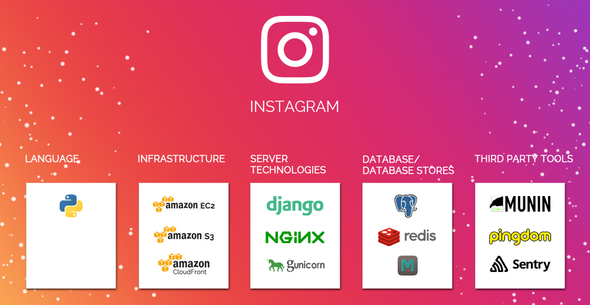

# Django

### The web framework for perfectionists with deadlines

---

## Structure

Django has a "batteries-included" philosophy, with a fully-functional ORM out of the box, session handling, a default admin portal, url handling, middleware, and more. As a framework, it is accessible to beginners yet scalable to production demands.
[As they put it](https://www.djangoproject.com/start/overview/), Django is "ridiculously fast, fully-loaded, reassuringly secure, exceedingly scalable, and incredibly versatile."

@fa[fab fa-github](https://github.com/django/django)

---

## Django in the wild

+++

Other notable companies include Disqus, Spotify, YouTube, The Washington Post, BitBucket, DropBox, EventBrite, Mozilla, & Prezi.

Sources: [SayOne](https://www.sayonetech.com/blog/software-stack-five-hot-startups-running-django/) and [NetGuru](https://www.netguru.co/blog/top-10-django-apps-and-why-companies-are-betting-on-this-framework)

---

## Project setup

- Install Python & virtualenv |
- Start a project directory with a virtualenv |
- `pip install -m django` |
- `django-admin startproject <project_name> .` |
- Hey look! You've got a bunch of project files! |
- `django-admin startapp <app_name>` |
- Hey look! You've got an app directory with more auto-generated files! |

---?code=sample/Python/sample.py&lang=python&title=Important components

@[1,3-6](Present code found within any repo source file.)
@[8-18](Without ever leaving your slideshow.)
@[19-28](Using GitPitch code-presenting with (optional) annotations.)

---?gist=dwbelliston/c0cb4975483c39f5658e7e23ba040e5a&lang=python&title=This GIST could legitimately be usable

@[23](You can even present code found within any GitHub GIST.)
@[41-53](GIST source code is beautifully rendered on any slide.)
@[57-62](And code-presenting works seamlessly for GIST too, both online and offline.)

---

### Tutorials

Beginner-friendly: DjangoGirls "Blog" tutorial

Intermediate: MDN "Library" tutorial

Advanced: Django Documentation "Polls" tutorial

Extension: [Harry Percival's Test-Driven "To-Do Lists" tutorial](https://www.obeythetestinggoat.com/pages/book.html)

+++

### Other Resources

Non-traditional Django: [Lightweight Django](https://github.com/lightweightdjango)

Asynchronous Django: [An outlook](https://www.aeracode.org/2018/06/04/django-async-roadmap/) and [an implementation](https://realpython.com/asynchronous-tasks-with-django-and-celery/)

Awesome Django: [No really, that's what it's called](http://awesome-django.com/).

---?image=assets/image/gitpitch-audience.jpg

@title[Download this Template!]

### Get your presentation started!
### [Download this template @fa[external-link gp-download]](https://gitpitch.com/template/download/aqua)
